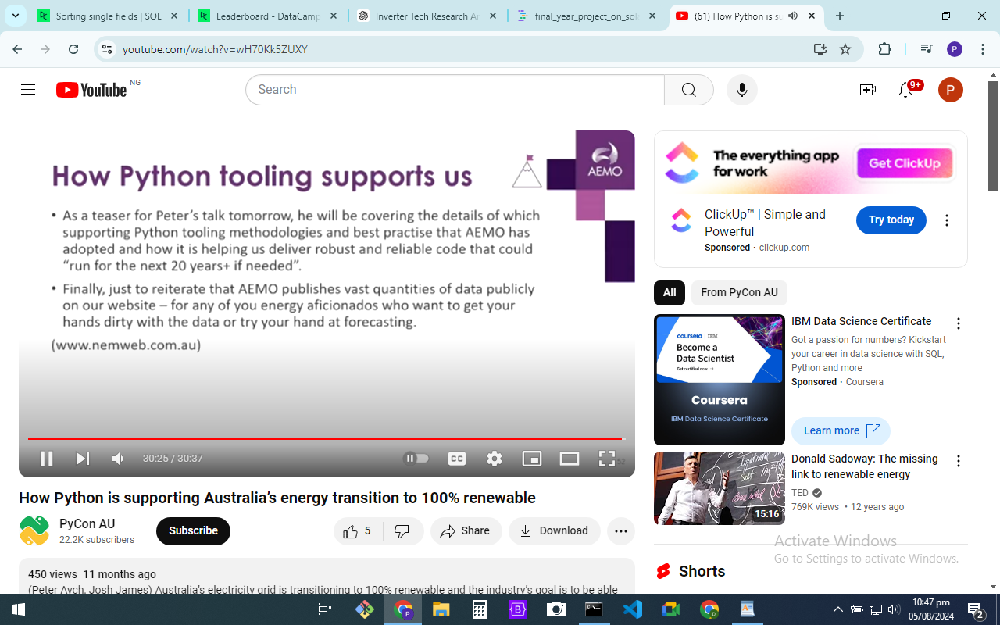

# final_year_project_on_solar_simulation_optimization_forecasting_with_pvlib

https://youtu.be/wH70Kk5ZUXY?si=al9xKUEweof7VF6w
 <type name="Arial" format="ttf" glyphs="/usr/share/fonts/fonts/arial.ttf"/>
 <type name="OpenSans-Semibold" format="ttf"  glyphs="/usr/share/fonts/fonts/OpenSans-Semibold.ttf"/>
 <type name="Helvetica-2" format="otf" glyphs="/usr/share/fonts/fonts/Helvetica.otf"/>
 <type name="Montserrat" format="ttf"  glyphs="/usr/share/fonts/fonts/31692f02-5637-4cd2-b973-99a09e542b83.ttf"/>
 <type name="Roboto" format="ttf" glyphs="/usr/share/fonts/fonts/Roboto-Medium.ttf"/>
 <type name="delulu" format="ttf" glyphs="/usr/share/fonts/fonts/delulu.ttf" />